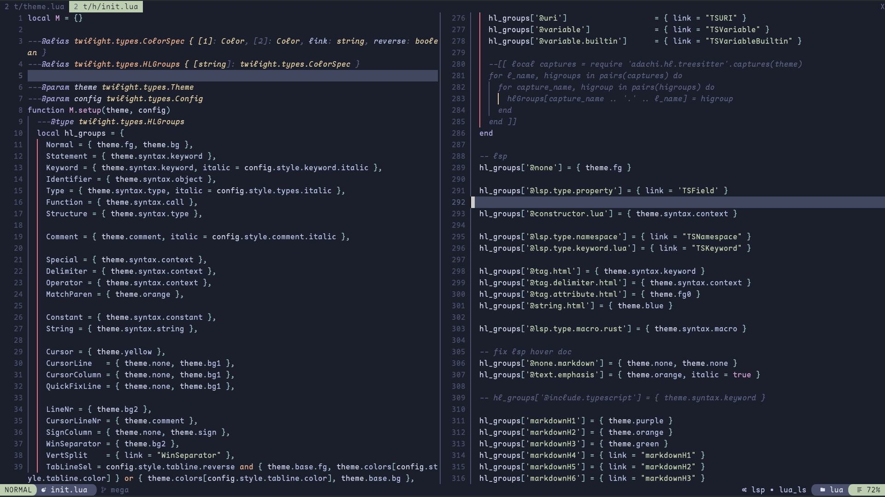
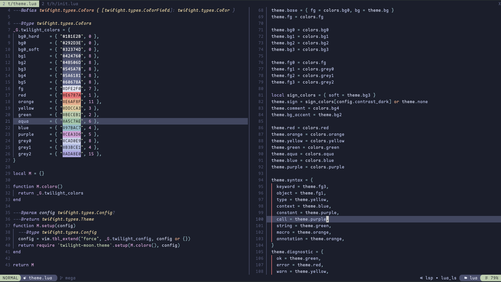

# twilight moon

twilight moon is a cozy neovim colorscheme for nightly programmers.

twilight moon is inspired by [nord](https://github.com/nordtheme/nord), [kanagawa](https://github.com/rebelot/kanagawa.nvim) and [blue-moon](https://github.com/kyazdani42/blue-moon)

evergarden was designed as a colorscheme with a focus on readability and visual comfort.
